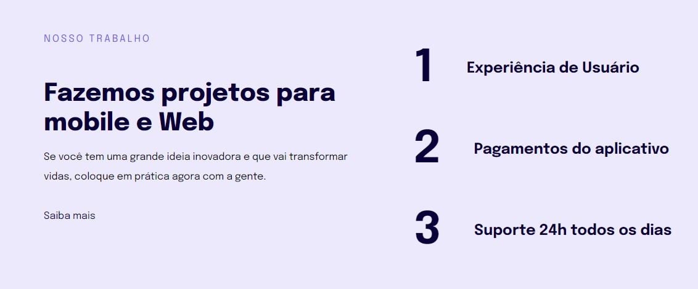

<h1 align="center"> Responsividade </h1>

Introdução a responsividade Web e Mobile

  <a href="#-tecnologias">Tecnologias</a>&nbsp;&nbsp;&nbsp;|&nbsp;&nbsp;&nbsp;
  <a href="#-projeto">Projeto</a>&nbsp;&nbsp;&nbsp;|&nbsp;&nbsp;&nbsp;

 

  

## 🚀 Tecnologias

Esse projeto foi desenvolvido com as seguintes tecnologias:

- HTML e CSS
- Git e GitHub

## 💻 Projeto

Esse projeto é uma introdução a responsividade, o site possui a versão web e mobile

Feito com ♥ by nicholasvp :wave: 
